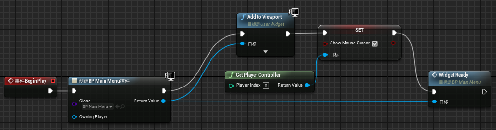
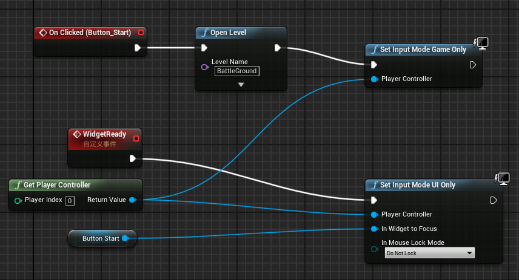
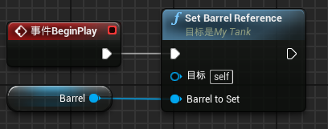

**UE4 BattleTank课程划重点**
===

[TOC]

# 地形绘制（Landscape Process）
1. *构建* 下有个 *光照质量* 选成 *preview/预览* 可以降低计算要求。
2. *设置*->*项目设置*->*地图和模式*->可以设置 *编辑器开始地图* 和 *游戏默认地图* 。
（写成中文就认得了...）
3. *Content Browser/内容浏览器*页面下，*Add New/新增*->*Add Feature or Content Packs/添加功能或内容包*->***Starter Content*** 可以添加 ***初学者内容包*** 。所以即使在建立项目时没有添加也没有关系。
4. 可以添加一个 *Volume/体积* ->*LightmassImportanceVolume* 这样渲染出来的时候不会提示没有ImportVolume，即使渲染的工作量也会变小。
5. *Landscape* 在*所有类*下，*Landscape*。*Location* 放在零点。</br>
   * 可以把原来的 *Landscape* 删掉再添加。
   * 也可以新建一个*Level*另起炉灶，但是要复制原有的*Level*的*Player Start、SkyLight、SkySphere、Light Source*等等，你懂的。
6. 地图建立以后还想修改尺寸、分辨率：
   1. 选中地形，*mode* 下 
   2. *manage mdoe/管理* 下 
   3. *选择工具* 选择 *Change Component Size/修改组件尺寸*
   * 这样可以将高模转换为低模，也可以将低模转换为高模，修改分辨率。
7. 添加地形多层材质
   1. 创建一个 *Material*, M_Landscape
   2. 材质编辑器中添加 *LandscapeLayerBlend* ，链接至*BaseColor/基础颜色* 上
   3. 在 *detail* 中 *+/加号* 给 *LayerBlend* 添加多种材质输入
   4. 添加多个 *VectorParameter* 链接到 *LayerBlend* 上
   * *LayerBlend* 就拥有了多种材质了
8. 给地形刷上颜色
   1. *mode* 选 *paint mode* 
   2. *target layers* 下点开 *layers* 
   3. 在 **每个** 层右边的小加号上单击一下，*创建层信息*->*权重混合层(法线)* 
   * 这样才能绘制，否则报错提示没有层信息
* 在创建地形时，可在在创建的时候 ***import from file**/**从文件导入*** ->*Heightmap File* 选择位图就能创建地形图。
* 绘制时及时保存，**Ctrl+Shift+S**，保存所有。
---

# 导入Mesh_FBX（Actors From Multiple Mesh，Lesson 115）
1. 导入文件为FBX格式
2. *import/导入* 导入时，窗口下 *Mesh* 展开，**勾选 *Combine Meshes* 选项**
* 记得勾选哦
---

# Actor/Pawn（Actors From Multiple Mesh，Lesson 115）
1. 蓝图
   1. Tank为Pawn. 新建一个Blueprint角色为*Pawn*.
   2. 打开*BP_Tank*，左侧 *组件* 下，在*DefaultScenceRoot*下，添加组件*StaticMesh/静态网格*，命名为*Tank*。
   3. 选中静态网格*Tank*，在 *Detail/细节*->*StaticMesh* 下，选择导入的Tank FBX的 *Body*。
2. 添加Sokcet
   1. 给Body添加Socket，进入Body。
   2. 右下角 *Socket Manager/插槽管理器* -> *Create Socket/创建查插槽* ->命名为 *Turret* 。
   3. 添加 *Preivew Static Mesh* 为新的插槽插上 *炮塔/Turret* 的StaticMesh
      * **注意**：这里的*Preview*说明了这个只是在调整*Socket/插槽* 位置的时候用来预览的模型，并不是在这里选好了Mesh就意味着已经组装好组件了，具体的组装还要在BP里面去做，这就是**预览/Preview**的意思。
   4. 调整Socket的位置，使得炮塔的Mesh能够安装在Tank顶部。
3. 通过Socket添加Turret
   * 有了Socket之后就可以往Socket上装Mesh东西了。
   1. 打开BP_Tank。
   2. 在Tank节点下添加子节点，*Static Mesh* -> 命名为 *Turret*。
   3. 选中 *Turret* 节点，*Detail*->*Static Mesh*->添加*Turret 的 FBX*。
      * 确定了其Mesh。
   4. *Socket* 一栏，*Parent Socket/父套接字* 选择 *添加Socket* 步骤中添加的Sokcet:**Turret**。
      * 确定了与父对象相对的安装位置。
4. 通过Socket添加Barrel
   * 类似上一步。如下：
   ```flow
   st=>start: 打开Turret
   step1=>operation: 添加Socket，选择Barrel Mesh，调整Socket位置
   step2=>operation: 打开BP_Tank，Turret下添加Static Mesh子节点，命名Barrel
   step4=>operation: 打开Detail面板
   step3=>operation: Detail下Barrel选择Static Mesh和Parent Socket
   e=>end
   st->step1->step2->step3->e
   ```
   * **注意**：这一步之后，可能Barrel不在socket的位置，仔细看Detail下的Transform->Postion是否为**零点**。避免低级问题浪费时间。
5. 添加Track
   * 添加左右履带，同上。
6. 把*tank*节点拖到*Default Scence Root*节点上，**替换**掉，如果不替换，等会儿spawns 出来的时候，*Pawn不会跟着tank本体。*
---

# Configuration a Tank (Lesson 117)
1. 打开物理模拟（Simulate Physics）
   1. *BP_Tank* 下*Detail*
   2. 勾选*Simulate Physics*
   3. 勾选*Mass in Kg*，填上重量40t。
2. **Set BP_Tank as Default Pawn** ***(重点)***
   主要工作如下：
   * Create a BP_BattleTankGameMode
   * Assign the tank as the Default Pawn
   * Check the correct tank spawns on play

   ## Create a BP_BattleTankGameMode（类->蓝图）
   1. *Content Browser*->*C++ Classes*->*tank*文件夹
   2. * *推荐*：单击*Blueprint*->*GameMode: Not overriden/游戏模式未覆盖!*->*create*->**tankGameModeBase** *(名字和C++类相同)*，命名为*BP_tankGameModeBase*
      * 或者：右键*tankGameModeBase*，选择*Create Blueprint class based on tankGameMode*
         * 因为第二种方法不会新建Blueprint文件夹，第一个会自动新建并选择位置。
         * ***这样就把BP和C++类联系起来了。***
   ## Assign the tank as the Default Pawn
   1. 在GameMode的BP里面，*Default Pawn Class*设置为*BP_Tank*。
      * 这个就是指这个GameMode一开始的时候，首先possess的Pawn。
      * 此时play，就会possess一个Tank了。
   2. 出生点可能低于平面或者有碰撞，不出生Tank，挪动出生点即可。
      * 在*Window/窗口* -> *Output Log*可以看到报错。
   3. 有可能出生以后视角不跟着Tank动：把BP_Tank下*tank*节点拖到*Default Scence Root*节点上，**替换**掉，如果不替换，等会儿spawns出来的时候，*Pawn不会跟着tank本体。*
   ## Check the correct tank spawns on play
   * 出生以后，Tank放在一定高度上，会摔一下，镜头应该跟着一起动。
   * 在Content里面Play后也自动出生一个。
---
# 3rd Person Camera Conrtrol(Lesson 118)
1. 添加*Spring Arm*，把*Spring Arm*放到*Tank*节点下。
2. 添加*Camera*，把*Camera*放到*Spring Arm***节点下**。
3. 调整*Spring Arm*中心位置和*Camera*位置
   * 此时，手动旋转*Spring Arm*发现*Camera*以*Spring Arm*中心点（即*Tank*本体）旋转。
4. *设置->项目设置->输入->Bindings->Axis Mappings/**轴**映射* 下，添加鼠标XY轴，命名为*AimAzimuth*和*AimElevation*。
   * 这里，创建了输入事件。
5. *BP_Tank* 蓝图下，*我的蓝图* 窗口，*Graphs/图表* 添加一个*Input Setup*子图。
   * 这里，可以在蓝图中响应输入事件，子图命名可任意。
6. 蓝图中创建输入事件、响应动作并建立连接。
   1. 右键添加，*AddLocalRotation***函数**（是函数，选择目标是*SpringArm*的选项），*InputAxis/输入轴 AimAzimuth*事件。
      * 图中此时有*AddLocalRotation*函数、*InputAxis/输入轴 AimAzimuth*事件、*SpringArm*变量（Get、获取）
   2. 连接Azimuth。
      * AimAzimuth exec->AddLocalRotation exec.
      * SpringArm->AddLocalRotation Target/目标. 
      * AimAzimuth Axis Value->AddLocalRotation（**右击DeltaRotation，Split Struct Pin/分割结构体引脚**） Delta Rotation Z (Yaw)
         * 可以中间加入一个*Multiply*调整转动速率。
   3. 连接Elevation。
      * 同上。
7. 测试。发现鼠标控制摆动**不符合预期**，但鼠标XY轴事件动作响应正常。
# Fixing 3rd Person Camera Rotation(Lesson 119)
* 原因：Rotate的时候坐标不固连于关节支座，而是与臂固连，一旦摆动XYZ平面就不和父节点基准面正交平行了。
1. Azimuth与Elevation分别连接于不同对象，Elevation控制目标为*SpringArm*，不修改。
2. 在*Tank*节点下添加一个*Scence*节点，命名*Azimuth Gimbal(水平支架)*。
   * 意为使其保持水平，在这个始终相对父节点为水平（即Roll和Pitch相对父节点始终为0）的*支架*上再做Pitch运动即可解决问题。
3. *SpringArm*挂在*Azimuth Gimbal*节点下。
   * 此时结构为*Azimuth Gimbal*->*SpringArm*->*Camera*
4. 坐标归零，使之后偏转没有偏心距。
   * *Camera*的*Position、Rotation*归零到*SpringArm*，调整*SpringArm*的*Target Arm Length*
   * *SpringArm*的*Position、Rotation*归零到*Azimuth Gimbal*，调整*Azimuth Gimbal Position*
4. 从*Component/组件*中拖拽*Azimuth Gimbal*到BP，或者在BP中添加*获取Azimuth Gimbal变量*
5. 将*Azimuth Gimbal*作为*AddLocalRotation*函数的*目标*输入，*输入轴Azimuth*作为函数*Yaw*的输入值（需右键展开），完成连接即可。
6. 补充：此时父节点（即车）如果在坡上倾斜了，视角三个轴都会倾斜，如果需要某个轴不随地形变化，可以在*SpringArm->Camera Settings*下取消勾选*Inherit xxx*即可。
   * 实验证明，旋转全都继承（*Inherit*），体验最逼真。
---
# User Interface (UI) (Lesson 120)
* 在图显示界面中央添加一个白点
## *Widget Blueprint*蓝图
   1. *新增/Add New->User Interface/用户界面->Widget Blueprint/控件蓝图*，命名*PlayerUI*
   2. *Common/通用*下拖拽一个*Image*到画布中，*层级*框中命名为*AimPoint*，拖出一个小白框
   3. 单击选中*AimPoint*显示范围框的左上角会出现*Anchor/锚点*
   4. 拖拽*锚点*到X:50%,Y:33.3%的中间偏上位置
   5. 调整*AimPoint*的*detail*：*Position*XY归零（此时小白框左上角对准*Anchor*），*Alignment*都为0.5（*Alignment*是百分比单位，0.5=50%）
## *Player Controller*蓝图
   1. *新增/Add New->Blueprint Class/蓝图类->Player Controller*，命名*BP_TankPlayerController*
   2. 打开*Graphs->Event BeginPlay*
   3. *Event BeginPlay*连接到一个*CreateWidget*(*UserInterface*分类下)，*Class*选上一步的*PlayerUI*
   4. *Create Player UI Widget*连接到一个*Add to Viewport*(*exce*和*Target* Pin对应连接)
   * We almost there, hold on.
## Set the Player Controller
   * Find the game mode blueprint for this Level
   * Set the Player Controller to be our new BP Class
   * Test the aiming dot shows up.
   1. game mode blueprint 即*BP_tankGameModeBase*
   2. 修改*Player Controller Class*为*BP_TankPlayerController*
   3. 测试。
## 补充：Unreal中添加Alpha通道的图片
   1. 目前*AimPoint*是一个白色的小框（虽然之后会有控制变色的设计实现），可以通过修改*Appearance->Brush->Image*添加图片修改显示，因为其本身就是*Image*控件。
   2. Alpha透明通道的透明图片可使用PS画出。
      1. 打开PS，新建图片，设置尺寸
      2. 右下角，*图层*切换到*通道/Channel*
      3. 单击下面的*新建*，会直接新建一个*Aplha*通道
      4. 可以直接在各个通道（ARGB）上作图了。
      5. 导出时，选择有Aplha通道的格式导出（如：*.exr格式）
## 使用 *UserWidget* UI 的思路
   1. 新建蓝图并绘制UI，*BP->UserWidget*
   2. 新建*PlayerController类* 蓝图，并设置*GameMode*
   3. *BP_PlayerController*中*Create Widget*并且*Add to Viewport*
---
# Main Menu UI（Lesson 121、123）
* 构建主菜单
## Add a New Level
   1. *Add New->Level/关卡*，命名*MainMenu*，将所有Level文件都放在新建*Levels*文件夹下
   2. 双击打开全空的*MainMenu*，*蓝图->打开关卡蓝图*
      * （不用*GameMode Override*，后文的*BeginPlay*与BP有关，不在GameMode里面）
## Add Widget from Level Blueprint
   * Open the MainMenu Level BP
   * Create BP to add widget to screen
   * Test this works with a button, image or something.
   1. Open the MainMenu Level BP
   2. Create BP to add widget to screen
      1. 添加*用户界面->UserWidget/控件蓝图*，同*PlayerUI*
      2. 添加*Image*，*Brush*选Tank作为背景图片
      3. *Levels->MainMenu->蓝图->打开关卡蓝图*
      4. *Create Widget*并且*Add to Viewport*
         * 此时鼠标单击激活窗口以后，就不显示了，显示出来才能执行之后的单击操作
      5. 添加连接*Add to Viewport->Set Show Mouse Cursor*，勾选*Show Mouse Cursor*选项,*Set Show Mouse Cursor*的*目标*是*Get Player Controller*，*Player Index*是默认的0
         * **注意**：这里*添加操作*时有可能找不到*Set Show Mouse Cursor*，在*输入弹出框*的右上角有一个***情景关联***，**取消勾选**即可搜索到结果。
         * 此时，就会实现鼠标显示不隐藏的功能了。
## 图片自动缩放（ScaleBox）
   * UserWidget中，通过拖拽*Archer/锚点*实现图片自适应大小，会出现比例失真，可以通过*ScaleBox*自适应大小
   1. 层级如下：*[BP _MainMenu]->[Canvas Panel]->**[ScaleBox]**->[MainMenu Background]*
   2. 调整*ScaleBox*的*offset/偏移*，让其*顶底左右*四个方向偏移都为0即可。
      * 要先拉开*Archer*，要不会显示*XY坐标*以及*长宽*，没有偏移参数。
   3. 运行测试。
---
# **关于GameMode的总结+工程修正** *倾力打造，重磅来袭*
   1. 工程修正
      * 问题： 在操作到上面步骤运行的时候，发现*MainMenu Level*启动以后，中间有*AimPoint*。
      * 解决：
         1. 问题在于整个项目设置*Default Modes*下*Default Pawn Class*是*BP_Tank*，*GameMode*启动的时候，直接把一个Tank个Spawns出来了，所以就有*AimPoint*了。
         2. 在项目设置*Default Modes*下，*Default Game Mode*改回*GameModeBase*,*GameMode*也行，下面的选项都默认了。
         3. 在*BP_tankGameModeBase*下设置*Player Controller Class*和*Default Pawn Class*配置为Tank的。
   2. 总结
         * **所以为什么要*Override*掉*tankGameMode*的蓝图呢?**
         ```
            因为直接编辑*tankGameMode*的BP没有上面的选项。
         ```
---
## Buttons
   * 添加一个*Button*，实现单击后进入*tankGameMode*的功能：
   1. 添加一个*Button*，拖拽并放置。
   2. *Detail*下找到*onClickEvent*事件，单击*查看*打开事件响应蓝图。
   3. *exce*连接到*OpenLevel*函数下，填入*tankGameMode（注意名称与实际 Level名称对应）*
   4. 测试，单击按键能够进入下一个*Level*。
   * 设置Button为默认按钮：
   1. *SetInputModeUIOnly*
      * 设置后进入关卡以后还是*UIOnly*模式**不响应鼠标**
   2. 添加*SetInputModeGameOnly*
      * 所以**打开下一个关卡(OpenLevel)之后**，设置回*GameOnly*：即添加*SetInputModeGameOnly*
      
      
      * *WidgetEvent*是*CustomEvent*，见下节。
## 自定义事件（Custom Event）的生成和调用
   1. 先构造出蓝色的*WidgetReady*：添加*CustomEvent*，命名为*WidgetReady*即可，需要**编译保存**。
   2. 再添加红色的*WidgetReady*：搜索*CustomEvent*下的*WidgetReady*即可。
---
# Delegating to Component（Lesson126）
   1. 添加一个*C++类*，*PlayerController*，命名*TankPlayerController*,*Public*
   2. 添加一个*MyTank类*，选*Pawn*
      * 来源：*BP_tank*父类是*Pawn*（打开BP，右上角显示父类）
   3. TankPlayerController.h添加：
   ```
   class TANK_API ATankPlayerController : public APlayerController{
      ...
      public:
	   AMyTank *GetControlledTank() const;
   }
   ```
   4. TankPlayerController.cpp添加：
   ```
   AMyTank *ATankPlayerController::GetControlledTank() const
   {
      return Cast<AMyTank>(GetPawn());
   }
   ```
   5. 编译。
   6. re-parent：
      * 打开*BP_Tank*，上方*类设置*，会切换到*Detail*下，*父类*选为*MyTank*
      * 打开*BP_TankPlayerController*，上方*类设置*，会切换到*Detail*下，*父类*选为*TankPlayerController*
   7. 编译。
---
# Using *virtual* and *override*

TankPlayerController.h :
```
class TANK_API ATankPlayerController : public APlayerController
{
	GENERATED_BODY()
	
public:
	// 获得spawns出来的Tank的Controller
	AMyTank *GetControlledTank() const;
	
	// 重写BeginPlay函数
	virtual void BeginPlay() override;
};
```
TankPlayerController.cpp :
```
#include "TankPlayerController.h"

AMyTank *ATankPlayerController::GetControlledTank() const
{
	// cast到返回类型，MyTank类是Pawn
	return Cast<AMyTank>(GetPawn());
}

void ATankPlayerController::BeginPlay()
{
	// 重写以后，一般都call父类
	Super::BeginPlay();

	auto controlledTank = GetControlledTank();
	if (!controlledTank)
	{
		UE_LOG(LogTemp, Warning, TEXT("PlayerController NOT pocessing a tank."))
	}
	else
	{
		UE_LOG(LogTemp, Warning, TEXT("pocessing a tank: %s"), *(controlledTank->GetName()))
	}

	UE_LOG(LogTemp, Warning, TEXT("PlayerController BeginPlay"))
}
```

* 如果上一步re-parent配置正确，则打印正确结果：
```
LogTemp: Warning: pocessing a tank: BP_Tank_C_0
LogTemp: Warning: PlayerController BeginPlay
```
---
# Overloading and Polymorphism(Lesson 128) **非常棒**

* 重载、重写、虚函数，Polymorphism（多态性）
* 父类函数以virtual修饰，继承的子类重写（override）以后，执行子类的函数。
* 父类函数不以virtual修饰，继承的子类有同名函数，执行子类函数。

```C++
using namespace std;

class Animal
{
public:
	// 不加virtual，输出“Animal makeNoise”
	// 加virual，输出子类的“makeNoise”
	virtual void makeNoise()
	{
		cout << "Animal makeNoise" << endl;
	}
};

// 传参一定是以地址的方式，Animal animal会造成复制。
// 注意，参数类型是Animal！
void Stroke(Animal *animal)
{
	animal->makeNoise();
}

// 继承Animal
class Dog : public Animal
{
public:
	void makeNoise()
	{
		cout << "Dog makeNoise" << endl;
	}
};

// 继承Animal
class Cat : public Animal
{
public:
	void makeNoise()
	{
		cout << "Cat makeNoise" << endl;
	}
};

int main()
{
	Dog dog;
	Cat cat;
	Stroke(&dog);	//输出"Dog makeNoise"
	Stroke(&cat);	//输出"Cat makeNoise"
	
	return 0;
}
```

---
# Virual Functions and Vtables(Lesson 129) **非常棒**  
* vtable 是个查找表，virtual以后会跳到vtable查函数入口地址。
* 不用virtual会硬编码到汇编里面，速度会快。
* 工具：www.godbolt.org 在线代码编译、汇编

---

# Creating an AI Controller Class(Lesson 130)
* *AI Controller*找到*AI Tank*
   1. 添加一个*AIController* C++类（需要勾选*显示所有类* 才能搜索到），命名*TankAIController*
   2. 类似*ATankPlayerController*，增加*GetControlledTank() const及BeginPlay() override*
   3. *BP_Tank->类默认值->AIControllerClass*选择*TankAIController*
      * 到这里，*TankAIController*就应该能够获得场上的*AITank*了
   4. 运行，应该能够打印*TankAIController*以及*TankPlayerController*中的UE_LOG，显示"pocessing a tank: xxx"获取了一个Tank的控制权。
* *AI Controller*找到*Player Tank*
   ```C++
   AMyTank *ATankAIController::GetPlayerTank() const
   {
      auto playerPawn = GetWorld()->GetFirstPlayerController()->GetPawn();
      if (!playerPawn) { return nullptr; }
      return Cast<AMyTank>(playerPawn);
   }
   ```
---
# BP、Class 之间的关系
* BP_Tank
   * 父类是C++ Class: MyTank， AIControllerClass:TankAIController
* BP_TankPlayerController
   * 父类是C++ Class: TankPlayerController
* BP_tankGameModeBase 类默认值
   * Player Controller Class: BP_TankPlayerContrller
   * Default Pawn Class: BP_Tank
---

# C++ Coding
## UE_LOG
   * 注意 \* 号操作符
   ```C++
   UE_LOG(LogTemp, Warning, TEXT("HitLocation: %s"), *HitLocation.ToString())
   UE_LOG(LogTemp, Warning, TEXT("HitLocation is that."))
   ```
## 获取屏幕大小
   ```C++
   // 获得屏幕大小
   int32 viewportSizeX, viewportSizeY;
   GetViewportSize(viewportSizeX, viewportSizeY);
   ```
## 得到世界（World）坐标系下，视线方向
   ```C++
   // "De-project"准星方向到世界（World）坐标系下方向，均一化
	FVector _cameraWorldLocation;	// Not used
	FVector LookDirection;
	bool bGetLookDir = DeprojectScreenPositionToWorld(
		screenLocation.X, screenLocation.Y,
		_cameraWorldLocation, LookDirection);
   if (bGetLookDir)
	{
      //--> GetLookVectorHitLocation(LookDirection, HitLocation);
		//UE_LOG(LogTemp,Warning, TEXT("Look direction: %s"),*LookDirection.ToString())
	}
   ```
## 视线碰撞点，LineTrace
   ```C++
   bool ATankPlayerController::GetLookVectorHitLocation(FVector LookDirection, FVector& HitLocation) const
   {
      FHitResult HitResult;
      auto startLocation = PlayerCameraManager->GetCameraLocation();	//获得摄像机位置，作为LineTrace起始位置
      auto endLocation = startLocation + (LookDirection*LineTraceRange);	//向量乘法与加法
      if (GetWorld()->LineTraceSingleByChannel(
         HitResult,
         startLocation,
         endLocation,
         ECollisionChannel::ECC_Visibility)
      )
      {
         HitLocation = HitResult.Location;
         return true;
      }
      //没打到，无碰撞
      HitLocation = FVector(0, 0, 0);
      return false;
   }
   ```
## Create Default Sub Objects in C++
   1. ActorComponent
      1. 新建C++ Class, *ActorComponent*，命名*TankAimingComponent*
      2. MyTank.j
      ```C++
      #include "TankAimingComponent.h"
      ...
      protected:
         ...
         UTankAimingComponent* TankAimingComponent = nullptr;
      ```
      3. MyTank.cpp, 使用函数：CreateDefaultSubobject
      ```C++
      // Sets default values
      AMyTank::AMyTank()
      {
         // Set this pawn to call Tick() every frame.  You can turn this off to improve performance if you don't need it.
         PrimaryActorTick.bCanEverTick = true;

         // 不用保护空指针，构造函数很少挂
         TankAimingComponent = CreateDefaultSubobject<UTankAimingComponent>(FName("Aiming Component")); //名字编译后会出现在BP中

      }
      ```
## Blueprint Callable
   1. UFUNCTION(BlueprintCallable, Category = SetupXXX)
      * MyTank.h:
      ```C++
      // 设置、获取Barrel
      // 暴露给蓝图
      UFUNCTION(BlueprintCallable, Category = Setup)
      void SetBarrelReference(UStaticMeshComponent* BarrelToSet);
      ```
   * MyTank.cpp
      ```C++
      // 设置Barrel给Component
      void AMyTank::SetBarrelReference(UStaticMeshComponent * BarrelToSet)
      {
         TankAimingComponent->SetBarrelReference(BarrelToSet);
      }
      ```
   * 编译之后，SetBarrelReference在蓝图里面可以添加。
   * BP_Tank:   
   


# 这是h1
###### 这是h6
